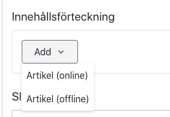
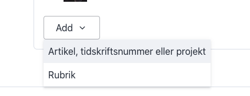

# Paletten.net: administrationssystem

## Redigering av textinnehåll

* Bildtexter läggs till i popup-rutan där bilden laddas upp. Samma gäller för video och ljud.
* För bilder och video finns två layoutalternativ i popup-rutan: fullbredd och bakgrundsfärg.
* Videofiler måste vara av typen *'.mp4'*
* Ljudfiler måste vara av typen *'.mp3'*

## Medverkande

Författare kan koppas till i *Artikelposter* genoma att först skapa en separat *Medverkandepost*, och sedan läggas till udner fältet _Författare_. 

## Tidskrifter

Innehållsförteckning kan fyllas med:

### Artikel (Online)

Länkar till en artikel-post

### Artikel (Offline)

Title fylls i och författare väljs manuellt.

## Förstasida

De tre kolumnerna kan fyllas med artiklar, tidskrifter, projekt och avdelas med rubriker.

För artiklar, tidskrifter, projekt kan även en bakgrundfärg väljas.
